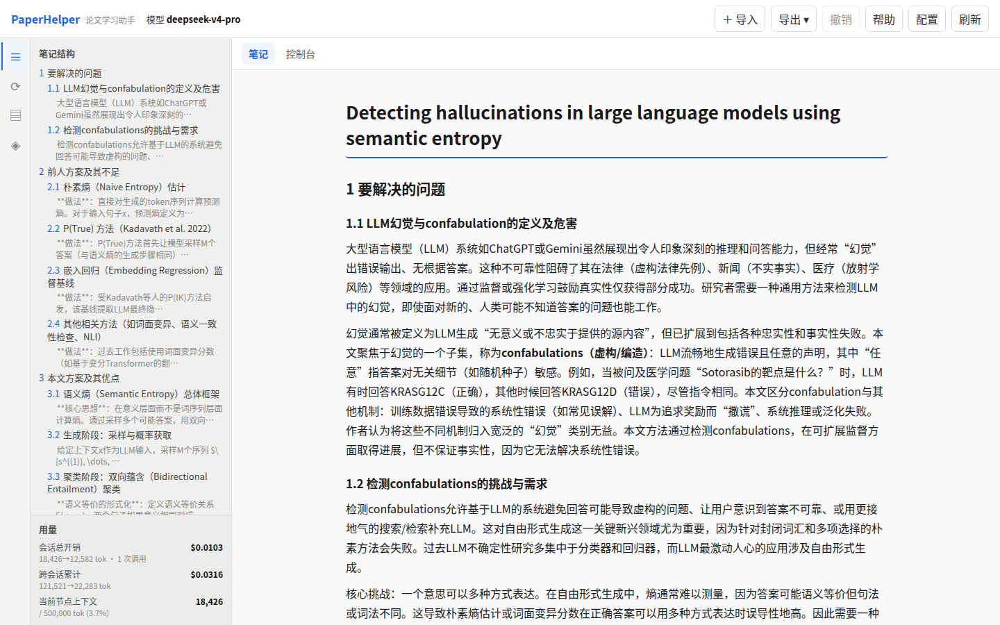
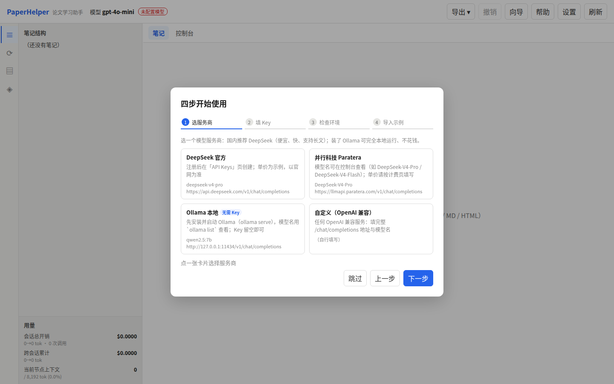

# PaperHelper — 论文学习助手

读论文时遇到不懂的概念就追问，追问中又引出新的前置知识，等搞明白已经忘了主线？通用 AI 的对话只会向前延伸，几次深入追问后就丢失上下文。

PaperHelper 用**树形对话 + 笔记批注**解决这个问题：每次追问是树上的一个节点，随时跳回主线或其他分支继续提问；在笔记里**选中文字即可就地提问**，答案钉在原文位置，点击高亮即可回看。

主界面是**浏览器 Web 应用**（`paperhelper web`），也提供功能等价的**命令行界面（CLI）**。Windows 用户下载安装包即可使用，无需安装任何环境；见下方[「安装与部署」](#安装与部署)。



## 三步上手（Windows 10/11）

1. **下载安装**：打开 [Releases](https://github.com/Ru645/paperhelper/releases/latest) 下载 `paperhelper-setup.exe` 双击安装（或 `paperhelper-windows-x64.zip` 解压后双击 `paperhelper-desktop.exe`）。不需要装 Python / Rust / 任何命令行工具。若 Windows 弹「已保护你的电脑」，点「更多信息 → 仍要运行」即可（未签名应用的正常提示）。
2. **粘贴 API Key**：首次打开会自动弹出向导——选服务商（推荐 DeepSeek）→ 到服务商网站创建 API Key 复制回来 → 点「测试连接」→ 检查环境。Key 只存在本机。
3. **导入论文**：把 PDF 拖进窗口 → 选「论文 → 生成笔记」→ 在笔记里**选中不懂的文字点「提问」**。想先零成本体验，点向导第 4 步的「导入示例」。

更详细的图解版（花多少钱 / 数据放哪 / 扫描版 PDF / 离线可用性 / 报错排查等常见问题）见 **[快速开始.html](快速开始.html)**：安装包与 zip 内已附带，安装后开始菜单里也能直接打开。

## 核心功能

- **树形对话，不丢主线**：每次追问是对话树上的一个节点，可随时跳回任意节点继续，历史永不丢；`sum` 把整棵追问子树折叠成一条「总结」，需要时再展开；批注弹窗左侧「**对话树**」只列出**当前这条批注**的对话（编号与 `tree`/`goto` 一致），当前节点高亮，点一下即切到该分支继续提问（右侧始终显示整条线程，不会被收窄成子树）
- **笔记内就地提问**：在笔记里选中一段文字 → 点浮出的「提问」→ 答案钉在原文，点击高亮回看；选中公式会自动还原成 LaTeX 交给模型；右键标题可对整节提问；**回答里还能继续追问**，批注层层嵌套。提问时可**附带图片 / txt / md / 另一份 PDF**（PDF 自动抽取文字）一起交给模型——附件只在本次发送，不写入会话历史
- **论文 / 讲义 → 结构化笔记**：把 PDF 拖进窗口，LLM 按所选风格生成含公式、表格、数值结果的详细笔记；也支持「原样导入」已有的 Markdown / TXT / HTML / 笔记——直接解析成笔记树，**不调模型、0 token**；或选「**仅阅读**」把 PDF 直接挂进来当原文看，同样不调模型、不生成笔记
- **原文（PDF）阅读器**：笔记区右上角一键切换「笔记 | 原文」，内置 [PDF.js](https://mozilla.github.io/pdf.js/)（随程序离线可用），支持翻页 / 页码跳转 / 缩放 / 目录 / 连续滚动。**可直接在原文上选中文字提问**：系统把选中内容与**该页截图**一起交给多模态模型，图文对照更准；选中内容会存成批注、原文高亮，点击高亮即可回看。仅针对当前会话导入的那份 PDF
- **笔记风格可定制**：内置「四段式 / 逐段翻译 / 中英对照 / 忠实照抄 / 讲义提纲 / 自由笔记」，界面里可新建 / 编辑 / 复制 / 删除 / 恢复默认自己的风格；导入时还能加一句「本次额外要求」
- **编辑与 AI 改写**：悬停笔记块即可改文字，或让 AI 重写 / 补充某段、按某风格重写整篇；所有编辑都能「撤销」（20 步，含删除）
- **跨论文知识库**：自动积累读过的论文与学到的概念，之后追问时自动关联已学知识
- **知识图谱**：顶栏「**知识图谱**」标签页把已学概念画成关系图——概念间关系由 LLM 判断（前置 / 相关 / 对比 / 包含 / 应用），连线无向、按类型着色，点节点弹出定义与关联（可「回看来源」打开概念详情页）；新增概念后点「更新关系」只让 LLM 处理新概念，也可「重建」全部重新判断
- **一键导出与迁移**：导出 Markdown / 思维导图（markmap）/ 自包含离线 HTML；会话与整库（会话 + 知识库 + 置顶）可导出 `.json`，在另一台电脑点「导入」即完成迁移
- **Windows 桌面版**：一键安装、**内置 Python 解析 PDF**，用户机器零依赖；原生窗口，双击即用，体验与 Web 版完全一致

## 更多细节

以下不算核心卖点，但都是日常好用的地方：

- **成本可控**：精确统计每次调用 token 与费用，可设预算，到上限自动中断
- **会话随手管理**：自动保存、列表置顶 / 重命名 / 删除 / 批量操作、随时恢复
- **等待不挡手**：生成期间可自由切换会话、看笔记与批注；结果自动写回**发起它的会话**
- **随时可停**：LLM 请求、PDF / OCR 子进程都能一键中止（Web「停止」/ `Ctrl-C`）
- **出错能排查**：错误给中文摘要与建议（Key 无效 / 限流 / 超上下文…），可展开原始响应；内置「测试连接」；所有操作有运行日志
- **更新不打扰**：启动时静默检查新版本（每天至多一次），有新版本才在顶栏出现「发现新版本」，点开可看更新说明、手动下载，也可「跳过此版本」；「设置」里随时可手动检查。**Windows 安装版支持一键更新**：点「立即更新」自动下载、校验 SHA-256、静默安装并重启（笔记与会话都在本机，不受影响）

## Web 界面

```bash
paperhelper web              # 默认 http://127.0.0.1:8080
paperhelper web --port 9000  # 指定端口
```

浏览器打开后即可使用。在运行服务的终端按 `Ctrl-C` 停止服务。

**首次使用向导**：第一次打开（还没有配置 API Key）自动弹出四步：① 选服务商（DeepSeek / Paratera / Ollama 本地 / 自定义）② 填 Endpoint 与 Key，可当场「测试连接」③ 检查 Python / PyMuPDF（缺了一键安装）④ 导入内置示例（0 token 直接看效果）。随时可点顶栏「向导」重看；未配置模型时发起提问也会自动跳到第 2 步。



**顶栏**：`导出 ▾`（Markdown / 思维导图 / HTML，浏览器下载）· `撤销` · `向导` · `帮助` · `设置` · `刷新`，并显示当前模型；发现新版本时还会出现「**发现新版本**」按钮。「设置」分两个标签：**模型设置**（端点 / 密钥 / 模型 / 上下文长度 / 思考模式 / 单价 / 预算）与**笔记风格**（可视化管理，格式要求由程序自动附加）；模型设置底部显示当前版本，可「检查更新」。

**笔记区**：
- **选中提问**：选中文字 → 浮出「提问」→ 小窗口问答、流式回答，与文字**高亮绑定**；选中公式会按 KaTeX 还原成 `$…$` 的 LaTeX 交给模型（只选中公式一小段时给出整条公式并注明片段）。
- **章节提问**：右键标题（h1=全文，h2/h3=小节）→「对本章节提问」。
- **回答里追问 + 记概念**：在回答中选中文字 → 继续提问，引用**持久高亮**、点高亮回看；「记概念」决定是否写入「已学概念」（默认开）。
- **批注弹窗**：可拖动、四条边与四角缩放、尺寸与输入框高度记忆；节点左键跳转、右键删除 / 总结；`sum` 后的节点显示为「总结」并可展开原对话；标题栏「**对话树**」按钮显示 / 隐藏弹窗左侧**本条批注**的对话树，点击任一节点切换上下文，右侧线程保持完整，之后的提问会挂到该节点下。

**原文（PDF）阅读**：笔记区顶部「**笔记 | 原文**」切换（当前会话导入了 PDF 时才出现）。阅读器支持连续滚动、上一页 / 下一页、页码直接跳转、缩放（贴合宽度 / 100% / 150% / 200%）与目录（`目录` 按钮）；在原文里选中文字 → 浮出的「提问」会把选中内容与**当前页截图**一起交给多模态模型，问题与回答仍按批注保存、选中处持久高亮，点击高亮回看；翻页 / 跳页不会打断正在进行的任务。若只想读原文、不需要笔记，导入时选「**PDF → 仅阅读（不生成笔记）**」：不调模型、不生成笔记，直接进入原文视图（扫描件也能看，提问时发送该页截图；若抽不到文字会提示这可能是扫描/图片版，可改用 OCR 导入）。

**侧栏**：左竖排活动栏（笔记结构 / 会话历史 / 已读论文 / 已学概念）切换右侧面板，可收起、可拖宽；底部常驻**用量**（会话开销、跨会话累计、当前上下文 token）。
- **会话历史**：顶部「＋ 新会话」；点条目加载；右键置顶 / 重命名 / 导出 / 删除。**迁移**：「导出全部」下载整库备份（含知识库、置顶、不含 API Key），在另一台电脑「导入」即可——编号冲突保留两者并自动改名、已导入过的自动跳过、跨机失效的笔记导出路径自动清空。
- **笔记结构 / 已读论文 / 已学概念**：点击定位或查看详情，「加载该会话」可回跳当时的问答（含滚动到原文、重开批注弹窗）。
- **批量操作**：三个列表都支持 **Ctrl(⌘) 点选、Shift 连选**，右键批量置顶 / 导出 / 删除。

**知识图谱**（顶栏标签页）：概念关系图（LLM 判断），点节点高亮邻居并弹出定义与关联、「回看来源」打开概念详情页；「更新关系」只处理新增概念，「重建」清空后全部重新判断。

**导入**：新建会话（或还没有笔记）时，笔记页中央「＋ 导入资料」；也可直接把 PDF / TXT / MD / HTML 拖进窗口。上传前选模式：
- **论文 → 生成笔记**：读论文全文，按所选风格生成笔记（默认四段式；扫描版可选 OCR）。
- **笔记 / 讲义 → 导入**：解析成笔记树、不调模型（按风格 AI 整理或「逐段翻译」也支持）。HTML 会自动转成 Markdown（公式按 KaTeX 还原、MathJax 的 `\newcommand` 宏定义自动收集注册，自定义宏照常渲染）。
- **PDF → 仅阅读（不生成笔记）**：只接受 PDF，不调模型、不生成笔记，导入后自动进入「原文」视图供阅读与选中提问；仍可切到空的「笔记」页，不自动导出。

导入窗口里还能填「**本次额外要求**」（拼到风格提示词之后）、「**另存为风格**」、或点「**管理…**」直接编辑风格。

**编辑笔记**：悬停任意标题 / 段落 → 浮出「✎ 编辑」：改文字、AI 重写 / 补充（流式写入编辑框，可边生成边改）、插入新块、删除该块（连子树与批注，二次确认）；编辑主标题时可「按风格重写全文」（会重建块 id 并清空批注，可用「撤销」恢复）。所有编辑 / 删除都能「撤销」。

**运行与等待**：调 LLM 的操作（导入 / 提问 / 批注 / AI 改写）同一时刻只允许一个，但生成期间**其余操作照常可用**（切会话、看笔记与批注、撤销、导出、改配置）。任务与**发起它的会话**绑定：切走后任务在后台继续、界面随时可回发起会话看流式进度，完成后写回那里（若会话被改动过会提示「已变更」不写入）；发起第二个 LLM 操作会明确提示「已有任务在运行」。所有 LLM 操作都有进度提示与「停止」（停止按钮仅在确有可中止的任务时出现，点了确实能停）：等待首个 token 时显示已发送上下文规模与计时；推理模型的**思考过程**流式显示在可折叠、可拖高的区域，你手动折叠后不会被后续输出重新展开；折叠 / 展开状态会记住，下次提问沿用同样状态。出错控制台显示中文摘要，可展开「详情」看原始 API Response，设置弹窗内可用当前表单值「测试连接」。

实现方式：`paperhelper web` 启动内嵌 axum 服务，把业务输出抽象为 SSE 事件流（`src/output.rs` 的 `Emitter`），前端原生 JS 消费。仅监听 `127.0.0.1` 不对外暴露。每个 HTTP 请求、每次 LLM 调用、命令执行都写入日志（见[「日志与排错」](#日志与排错)）。

## 命令行界面（CLI）

功能与 Web 等价，适合脚本化或服务器环境。

### 启动与恢复

```bash
paperhelper                 # 新会话
paperhelper -l              # 列出所有已保存会话（编号+标题）
paperhelper -s 20260909_020452   # 按编号恢复（支持唯一前缀，如 -s 20260909_02）
paperhelper --version       # 查看版本号（排查 / 反馈时用）
```

会话编号是**首次保存时的时间戳**，此后不变（每次 exit 覆盖保存同一编号）。`--completions` 可安装 bash 补全（含 `-s` 时间戳补全）。

### 使用流程

```
> ingest samples/某论文.pdf       # 导入论文，生成笔记
请输入笔记导出文件名（回车默认 笔记_xxx.md）: my_note.md
⠋ 笔记生成中…
✓ 笔记已导出到 my_note.md

> blocks                         # 看笔记结构和编号
   1   § 一、要解决的问题
   1.1   § 背景
   3.2   § 变体一：BERTScore
   ...
> ask 3.2 BERTScore的公式里max_k是什么意思   # 按编号追问，解释插入 3.2 节
> ask 3.2 它和余弦相似度有什么区别            # 对上一个回答再追问，自动嵌套
> sum                             # 折叠当前追问子树为「总结」
> stats                           # 看 token 用量和成本
> exit                            # 退出，自动保存
✓ 会话已保存：BERTScore与余弦相似度讨论
  恢复会话，请执行：paperhelper -s 20260909_021633
```

### 导入选项

```bash
> ingest samples/论文.pdf                        # PyMuPDF 提取文本 + 四段式笔记
> ingest --style translate samples/论文.pdf    # 逐段翻译（只译文）
> ingest --style lecture samples/讲义.pdf      # 讲义提纲（知识点 + 复习清单）
> ingest --style verbatim samples/资料.pdf     # 忠实照抄
> ingest --note --text samples/我的笔记.md     # 直接导入笔记/讲义（不调 LLM，0 token）
> ingest --note --ocr samples/扫描讲义.pdf     # 扫描件 OCR 后直接导入
> ingest --read samples/论文.pdf               # 仅阅读原件（不调 LLM、不生成笔记；扫描件也能看）
> ingest --extra "只保留公式和结论" --style free samples/资料.pdf
> styles                                       # 列出全部风格
```

- `--style <id>`：任意内置或自定义风格（`styles` 列出，提示词在 `.paperhelper/styles/<id>.txt`）
- `--note`：原样导入笔记/讲义，只解析不调模型；`--kind paper|note|lecture` 只影响列表类型标记
- `--read`：仅阅读 PDF 原件（只接受 PDF），不调模型、不生成笔记、不自动导出，直接看原文并选中提问
- `--extra "…"`：本次额外要求，拼到所选风格提示词之后
- `--text`：跳过 PDF 解析直接读文本文件；`--ocr`：扫描件 OCR（需装 tesseract，未装会给出指引）
- 翻译为**单次整篇**生成；输出达到上限被截断时会提醒「⚠️ 笔记可能被截断」

### REPL 操作

- `↑↓` 历史命令，`←→` 移动光标，`Ctrl-C` 立即打断当前任务
- Tab 补全：命令名、文件路径（`ingest/save/load/export`）、节点/笔记编号（`goto/ask`）、配置键（`config set`）

## 命令一览

| 命令 | 说明 |
|------|------|
| `ingest [--style <id>] [--extra "…"] <pdf>` | 导入 PDF 按风格生成笔记，自动导出 |
| `ingest --note <文件>` | 直接导入笔记/讲义（不调 LLM；`--kind paper\|note\|lecture`） |
| `ingest --read <pdf>` | 仅阅读 PDF 原件（不调 LLM、不生成笔记、不自动导出） |
| `ingest --text <txt>` / `ingest --ocr <pdf>` | 直读文本 / OCR 扫描件 |
| `ask <编号> <问题>` / `ask --no-concept <编号> <问题>` | 按编号定位追问，解释插入相关位置，递归嵌套 |
| `sum [n]` / `del [n] [--yes]` | 折叠/删除节点 n（默认当前）的子树 |
| `undo` | 撤销上一次编辑 / 删除（内存多级，最多 20 步） |
| `blocks` / `note` / `tree` / `goto <n>` | 看笔记结构 / 全文 / 对话轨迹 / 跳到对话节点 |
| `stats` / `budget <n>` | 用量与成本 / 设置 token 预算（0=不限） |
| `export md\|mindmap\|html [file]` | 导出笔记（自动补后缀） |
| `papers` / `concepts` | 列出已读论文 / 已学概念 |
| `graph [show\|build\|rebuild\|clear]` | 知识图谱：查看 / 让 LLM 整理新概念关系 / 重建全部 / 清空关系 |
| `styles` / `styles show <id>` | 列出笔记风格 / 查看提示词 |
| `save [file]` / `load <file>` / `new` | 保存 / 加载 / 新建会话 |
| `config show` / `config set <k> <v>` / `config presets [id]` | 查看 / 设置配置（见下）；预设一键预填 DeepSeek 等 |
| `config test` | 用当前配置发一条最小请求测试（失败打印原始响应） |
| `exit` | 退出（自动保存，并提示恢复方式） |

> **变更（0.8.0）**：已移除 `check` 命令与「核对」模式——提问一律写入笔记。旧会话里带 `[核对]` 标记的节点在加载时会自动清理为普通问答（不丢历史）。

> **变更（0.9.0）**：整会话**对话树**从侧栏移进**批注弹窗左侧**（默认显示，标题栏「对话树」按钮可收起 / 展开，选择会记忆）；点节点即切换上下文，之后的提问挂到该节点下。侧栏不再有独立的「对话树」面板。

> **变更（0.10.0）**：**知识图谱**从侧栏移到**顶栏标签页**（侧栏活动栏不再有 ⬡）；点节点弹出定义与关联，可「回看来源」打开概念详情页；关系连线改为**无向**（不再画箭头），仍按关系类型着色。

> **变更（0.11.0）**：思考过程区的折叠 / 展开状态会记住——本次折叠了，下次提问默认也折叠（三个区域各自记忆）。

> **变更（0.12.0）**：批注弹窗左侧的**对话树**改为只显示**当前这条批注**的对话（不再混入整个会话的其他节点）；点击节点仍切换上下文，但右侧**始终显示整条线程**，不再被收窄为该节点的子树。

> **变更（0.13.0）**：批注对话由「树」升级为**「森林」**——同一条批注下可以有多条互不相关的对话：点左侧对话树的**空白处**再提问，就会另起一条新的对话根（不必再挂到已有节点下）；右侧始终显示本条批注的**全部对话**。批注弹窗左侧对话树**可拖动调宽**（「对话树」按钮可收起 / 展开），并新增**「停靠」**按钮，可把弹窗停靠成**右侧栏**、随页面一起排布（再点「浮动」恢复，停靠宽度也可拖动）；主侧栏的**折叠状态**现在会记忆。

---

## 安装与部署

### 1. 安装依赖

| 依赖 | 用途 | 必需性 |
|------|------|--------|
| Rust 1.85+ | 编译 | 必需 |
| Python 3 + PyMuPDF | PDF 文本层提取 | 必需 |
| tesseract + 中文语言包 | OCR 扫描件（`--ocr`） | 可选 |

```bash
# ① Rust（需 1.85+）
rustc --version

# ② 提取 PDF 文本（Rust 调用子进程，装的 PyMuPDF）
pip install pymupdf

# ③ OCR（可选）
sudo apt install tesseract-ocr tesseract-ocr-chi-sim    # Debian/Ubuntu
brew install tesseract tesseract-lang                    # macOS
```

> 没装 tesseract 时只有 `--ocr` 不可用，其余功能不受影响。

**Python 查找顺序**：`PAPERHELPER_PYTHON`（显式）→ 打包内置解释器 → Windows `py -3` → `python` → `python3`。`import pymupdf` 失败的报错会给出当前解释器的修复命令。

### 2. 编译

```bash
git clone <仓库地址> && cd paperhelper
cargo build            # 编译
cargo test             # 运行测试（110 个）
```

产物在 `./target/debug/paperhelper`；Windows 上多一个 `./target/debug/paperhelper-desktop.exe` 桌面窗口版。

### 3. 配置大模型（设置 → 模型设置）

最省事是跟着首启向导走；也可任选其一（优先级：环境变量 > `.env` > `.paperhelper/config.toml`）：

**方式 1：Web 设置弹窗（推荐）** —— 点顶栏「设置」→「模型设置」即改即存。

**方式 2：`.env`**
```bash
cat > .env <<'EOF'
PAPERHELPER_API_KEY=sk-xxxxxxxx
PAPERHELPER_API_ENDPOINT=https://api.deepseek.com/v1/chat/completions
PAPERHELPER_MODEL=deepseek-v4-pro
PAPERHELPER_CONTEXT_LENGTH=64000
EOF
```

**方式 3：CLI 交互**
```bash
paperhelper
> config presets deepseek          # deepseek/paratera/ollama/custom 一键预填
> config set llm.api_key sk-xxxxxxxx
> config set llm.model deepseek-v4-pro
> config set llm.api_endpoint https://api.deepseek.com/v1/chat/completions
```

> ⚠️ `api_endpoint` 必须是**完整 URL**（含 `/chat/completions`），不是 base_url。
> DeepSeek：`https://api.deepseek.com/v1/chat/completions`；OpenAI：`https://api.openai.com/v1/chat/completions`。

### 4. 启动

```bash
paperhelper web              # Web 界面（推荐，默认 http://127.0.0.1:8080）
paperhelper web --open       # 启动后自动打开浏览器
paperhelper web --port 9000  # 指定端口（被占自动顺延）
paperhelper-desktop          # Windows 桌面窗口版
paperhelper                  # CLI REPL
```

**Windows 桌面窗口版**：与 `paperhelper.exe` 同目录。双击开原生窗口，不用终端不用浏览器。它做的事：单实例互斥锁（重复双击聚焦已有窗口）→ 用隐藏控制台启动 `paperhelper web --port 0`（随机端口、不弹黑框）→ WebView2 打开本地页面 → 关窗先 `/api/interrupt` 再 `/api/shutdown` 优雅退出，服务进程放进 Job Object（崩溃也不残留进程在后台）。需要系统里有 Edge WebView2 运行时（Win10 1803+ / Win11 一般自带）。源码 `src/bin/paperhelper-desktop.rs`。

### 5. Windows 安装包 / 绿色版（维护者）

普通用户直接用 Release 的两个产物即可：`paperhelper-setup.exe`（安装到 `%LOCALAPPDATA%\PaperHelper`，桌面 + 开始菜单快捷方式，免管理员）或 `paperhelper-windows-x64.zip`（解压后双击 `paperhelper-desktop.exe`）。两者都内置 Python 与 PyMuPDF，用户机**不需要装 Python**；包内附《快速开始.html》。安装版支持应用内一键更新（自动下载安装包、校验后静默安装并重启）；绿色版点「手动下载」到发布页下载新版 zip。

自己出包（Windows 上）：
```powershell
pwsh scripts/package-windows.ps1                  # 编译 + 下载 Python/PyMuPDF + 出 zip 和 setup.exe
pwsh scripts/package-windows.ps1 -SkipInstaller   # 只要绿色 zip
```

CI：`.github/workflows/windows-release.yml` 推 `v*` tag 自动「编译 → 冒烟测试（`--port-file` 握手 + 探活）→ 打包 → 生成 update.json（含 sha256，供应用内一键更新读取）→ 发 Release」。`scripts/make-update-json.ps1` 会校验 tag 与 `Cargo.toml` 版本一致后再出清单。

## 配置项

| 配置项 | 说明 | 默认值 |
|--------|------|--------|
| `llm.api_key` | API 密钥 | 空 |
| `llm.api_endpoint` | 完整端点 URL | OpenAI |
| `llm.model` | 模型名 | gpt-4o-mini |
| `llm.context_length` | 上下文长度（token） | 8192 |
| `llm.thinking_mode` | 思考模式（给推理模型发 `reasoning_effort`） | false |
| `llm.pdf_input` | 声明模型支持 PDF 直传（file 模式，暂未实现均走文本） | false |
| `pricing.input_price_per_1m` | 输入单价 | 0.15 |
| `pricing.output_price_per_1m` | 输出单价 | 0.60 |
| `budget.token_budget` | token 预算（0=不限） | 0 |
| `update.auto_check` | 启动时自动检查新版本（每天至多一次） | true |
| `update.source_url` | 更新清单地址（留空用官方 `update.json`；可填镜像 / 内网，指向同样格式的 JSON） | 空 |

配置存储在 `.paperhelper/config.toml`（被 gitignore，不含密钥以外敏感项；Web 端「设置」直接改）。

## 数据目录

```
.paperhelper/
├── config.toml          # 配置
├── knowledge.json       # 跨论文知识库（论文/讲义/笔记 + 概念 + 累计用量）
├── styles.toml          # 风格清单（可编辑）
├── styles/              # 风格提示词（four.txt 四段式 / translate.txt 逐段翻译 / …）
├── prompts/             # 行为提示词（ask.txt 回答风格 / rewrite.txt AI 改写）
├── uploads/             # Web 上传的论文/讲义等
├── update_state.json    # 更新检查记录（上次检查时间 / 已跳过版本）
├── logs/                # 运行日志（超过 5MB 轮转）
└── sessions/            # 会话存档（文件名 = 会话编号 = 首次保存时间戳）
    ├── 20260909_021633.json
    └── 20260909_033219.json
```

以上文件均已被 `.gitignore` 忽略，不会误提交。

数据目录默认是**当前工作目录**下的 `.paperhelper/`。想固定位置（换工作目录也不"丢"笔记），可用环境变量 `PAPERHELPER_DATA_DIR`（支持绝对路径与 `~`）：

```bash
PAPERHELPER_DATA_DIR="$HOME/PaperHelper/.paperhelper" paperhelper web
# Windows：$env:PAPERHELPER_DATA_DIR="$env:USERPROFILE\PaperHelper\.paperhelper"
```

## 日志与排错

- **日志**：每个 HTTP 请求、每次 LLM 调用（模型/消息数/耗时/token/重试）、命令执行、上传、PDF/OCR 子进程都写入 **stderr 与 `.paperhelper/logs/paperhelper.log`**。级别 `PAPERHELPER_LOG`（`error`/`warn`/`info`/`debug`，默认 `info`）：
  ```bash
  PAPERHELPER_LOG=debug paperhelper web
  tail -f .paperhelper/logs/paperhelper.log
  ```
- **测试连接**：CLI `config test`，或 Web「设置 → 测试连接」，显示 HTTP 状态 / 耗时 / 原始响应。
- **错误详情**：错误给中文摘要，Web 可展开「详情」看完整错误链与原始响应；CLI 直接打印 `{e:#}`。
- **常见错误**：`401/403` Key 无效 / 无权限；`429` 限流 / 额度；`400 + 上下文` 超出长度；连接失败 → 网络/代理；`413` → 上传超 200MB。

## 自定义提示词

- **笔记风格**：编辑 `.paperhelper/styles/<id>.txt`（`{raw_text}` 会被替换为资料全文）或 `.paperhelper/styles.toml` 中添加删；Web「设置 → 笔记风格」可视化操作。内置风格删除后重启自动恢复。
- **行为提示词**：编辑 `.paperhelper/prompts/{ask,rewrite}.txt`；改完重启生效，删除恢复内置。
- **补全预设**：`config.toml` 的 `[presets]` 增删 `config set llm.model` / `endpoint` 的候选：
  ```toml
  [presets]
  models = ["deepseek-v4-pro", "deepseek-v4-flash", "gpt-4o-mini"]
  ```

---

## 技术架构

- **Rust 主控**：PDF 解析、笔记树、对话树、编号、批注、定位、导出、统计全部 Rust 确定性逻辑；**LLM 只产自然语言**（笔记、回答、概念名、总结）。
- **两棵树**：笔记树（Section/Paragraph，`sum` 折叠）+ 对话树（每节点一次 Q&A，节点根路径即上下文）。
- **文本锚点批注**：批注记录「锚点 + 选中文字」（`block_id` / `node_id`），渲染时按可见文本匹配、跳过 KaTeX 隐藏 MathML，含公式的引用也不破坏公式结构；选中公式时从隐藏层还原 LaTeX 作上下文。原文批注则记录页码 + 归一化矩形（`page` / `rects` / `kind`），在 PDF 文本层上重绘高亮。
- **PDF 原文阅读器**：前端内嵌 [PDF.js](https://mozilla.github.io/pdf.js/)（`web/vendor/pdfjs/`，Apache-2.0）负责渲染与文本层，`web/pdf-viewer.js` 是薄适配层；`/api/pdf/file` 只服务**当前会话**对应的原件（`pdf_source()`：笔记 `source_path` 优先，回退知识库论文路径），PDF 批注提问时把该页 canvas 渲染成 PNG（data URL）作为多模态图片随请求发送，不走检索。
- **向后兼容**：全部数据字段带 `#[serde(default)]`，老存档正常载入、新字段自动补齐。
- **文件布局**：数据放 `.paperhelper/`（config/knowledge/styles/sessions/…），Web 上传与笔记导出分开存放。
- **导入解析**：有标题建 Section 树、无标题按空行切段、HTML 走浏览器端白名单转换（锚点/脚本剔除）；MathJax 的 `\newcommand` 宏块收集进 `Note.math_macros` 供 KaTeX 渲染。
- **可编辑树**：块级编辑尽量保持块 id 稳定；`parse_markdown_blocks` 统一编号；`undo` 多级内存撤销。
- **流式 + 并发模型**：LLM 输出流式渲染（字节缓冲 + UTF-8 行边界解码，中文不会切花）；推理模型的 `reasoning_content` 走独立 SSE 事件。LLM 阶段不持锁（prepare → 锁外 run → commit 三段），用全局门串 + session 版本号 epoch 防误写，非 LLM 请求生成期间照常服务。
- **可中止 / 健壮性**：全局 `interrupt` 信号 + `tokio::select!`，LLM 发送/读取、重试退避、PDF/OCR 子进程（`kill_on_drop`）都能被停止；网络错误自动重试 2 次、超上下文自动截断早期对话、token 预算封顶、上传限量 200MB 流式写盘。
- **Web / CLI 双前端**：输出经 `output::Emitter` 抽象，一套代码同时写终端与 SSE（axum），前端原生 JS 打包；marked + KaTeX（含字体）离线内嵌，HTML 导出自包含、断网也渲染。

## 开发

```bash
cargo build            # 构建
cargo test             # 110 个单元测试
cargo build --release  # 发布构建
```

产物：`./target/debug/paperhelper`（或 release 版本）。第三方前端资源（marked / KaTeX，MIT；PDF.js，Apache-2.0）放 `web/vendor/` 并随仓库提交，`build.rs` 递归编译进二进制（升级 = 替换后重新构建）。